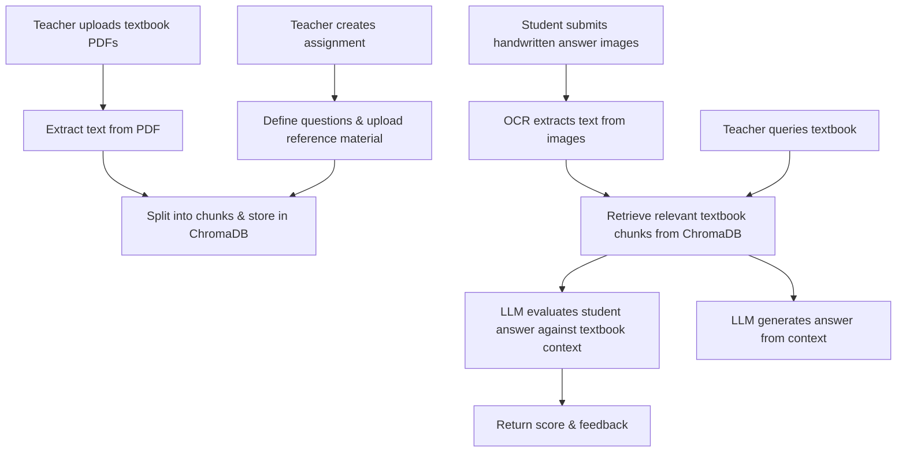

# Assignment Evaluation Assistant

An AI-powered web application that helps teachers create assignments, evaluate handwritten student answers, and query textbook content — all using RAG (Retrieval-Augmented Generation).

## Features

- **Upload Textbooks** — Upload PDF reference material and index it into a vector database for retrieval.
- **Create Assignments** — Define assignments with chapters, topics, questions, and marking criteria.
- **Evaluate Answers** — Upload photos of handwritten student answers; OCR extracts the text, and an LLM grades them against the textbook context.
- **Query Textbooks** — Ask natural-language questions and get answers grounded in uploaded reference material.
- **OCR Detection** — Standalone OCR tool to extract text from images of handwritten content.

## Workflow



## Tech Stack

| Component | Technology |
|---|---|
| Backend | FastAPI |
| LLM | Groq (Llama 3.3 70B) |
| OCR | HuggingFace (Qwen2.5-VL-7B) |
| Vector DB | ChromaDB |
| Embeddings | HuggingFace (all-MiniLM-L6-v2) |
| PDF Parsing | pdfminer.six |
| Frontend | HTML / CSS / JavaScript |

## Setup

1. **Clone the repo**
   ```bash
   git clone https://github.com/HassanCodesIt/Assignment-Evaluation-Assistant.git
   cd Assignment-Evaluation-Assistant
   ```

2. **Create a virtual environment**
   ```bash
   python -m venv .venv
   .venv\Scripts\activate   # Windows
   source .venv/bin/activate # Linux / Mac
   ```

3. **Install dependencies**
   ```bash
   pip install -r requirements.txt
   ```

4. **Set up environment variables**
   ```bash
   copy .env.example .env   # Windows
   cp .env.example .env     # Linux / Mac
   ```
   Edit `.env` and add your API keys:
   - `HF_TOKEN` — HuggingFace API token
   - `GROQ_API_KEY` — Groq API key

5. **Run the server**
   ```bash
   uvicorn main:app --reload
   ```
   Open [http://localhost:8000](http://localhost:8000) in your browser.

## Project Structure

```
├── main.py             # FastAPI routes
├── RAG.py              # PDF extraction, vector DB, LLM logic
├── ocr.py              # OCR via HuggingFace Qwen model
├── requirements.txt    # Python dependencies
├── .env.example        # Environment variable template
└── templates/
    ├── index.html      # Home page
    ├── assignment.html # Create assignment
    ├── evaluate.html   # Evaluate student answers
    ├── query.html      # Query textbook
    └── ocr.html        # OCR tool
```
