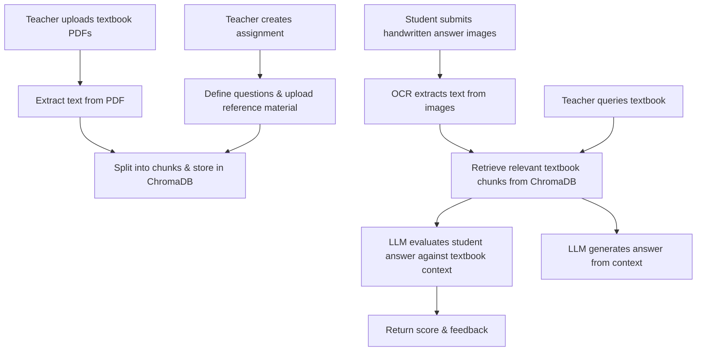
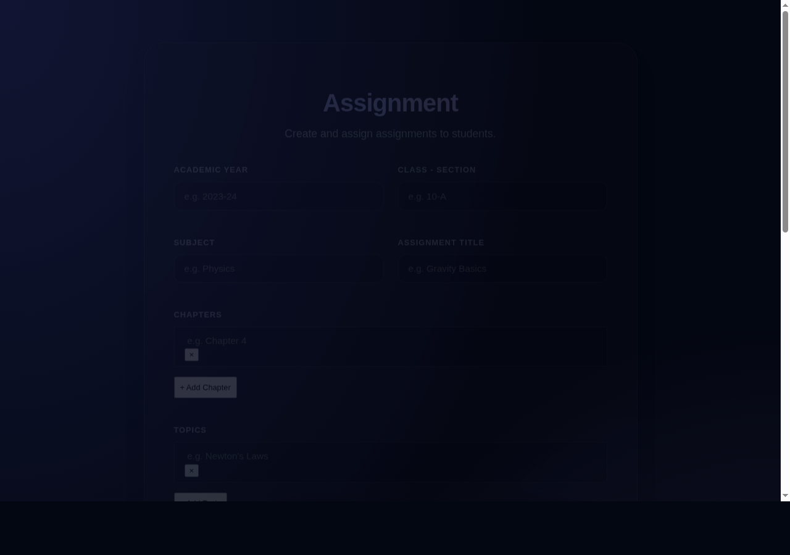
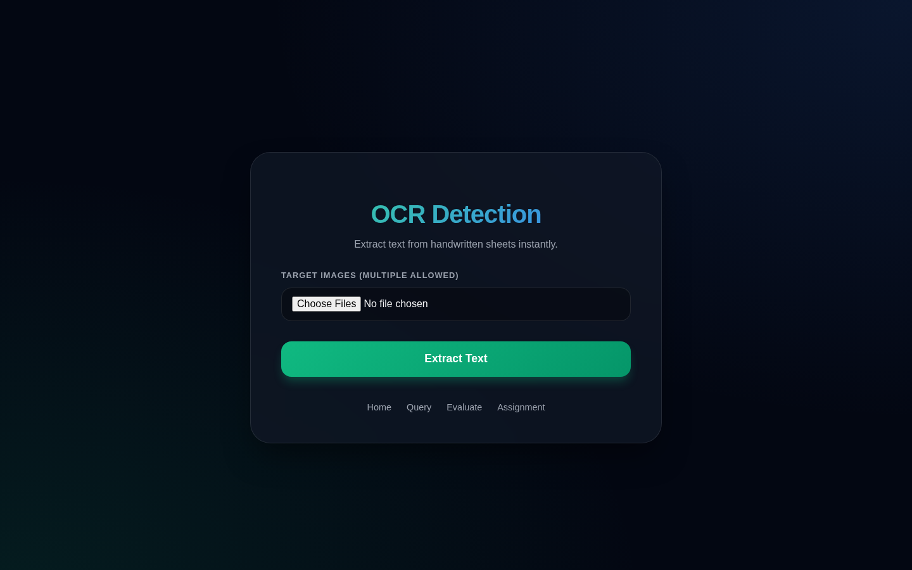

# Assignment Evaluation Assistant

An AI-powered web application that helps teachers create assignments, evaluate handwritten student answers, and query textbook content — all using RAG (Retrieval-Augmented Generation).

## Features

- **Upload Textbooks** — Upload PDF reference material and index it into a vector database for retrieval.
- **Create Assignments** — Define assignments with chapters, topics, questions, and marking criteria.
- **Evaluate Answers** — Upload photos of handwritten student answers; OCR extracts the text, and an LLM grades them against the textbook context.
- **Query Textbooks** — Ask natural-language questions and get answers grounded in uploaded reference material.
- **OCR Detection** — Standalone OCR tool to extract text from images of handwritten content.

## Workflow



## Screenshots

### Upload Page — Index textbook PDFs into the vector database


### Create Assignment — Define questions, topics, and upload reference material


### Evaluate Answers — Upload handwritten student answer images for AI grading


### Query Textbook — Ask natural-language questions grounded in uploaded content


### OCR Detection — Extract text from handwritten images standalone


## Tech Stack

| Component | Technology |
|---|---|
| Backend | FastAPI |
| LLM | Groq (Llama 3.3 70B) |
| OCR | HuggingFace (Qwen2.5-VL-7B) |
| Vector DB | ChromaDB |
| Embeddings | HuggingFace (all-MiniLM-L6-v2) |
| PDF Parsing | pdfminer.six |
| Frontend | HTML / CSS / JavaScript |

## How It Works

### 1. Indexing Textbook Content
The teacher starts by uploading one or more PDF textbooks on the **Upload** page and selecting a subject. The application reads and extracts all text from the PDFs using `pdfminer`, splits it into smaller overlapping chunks, generates semantic embeddings with HuggingFace's `all-MiniLM-L6-v2` model, and stores them in a **ChromaDB** vector database. Each subject gets its own collection, so content from different subjects never mixes.

### 2. Creating an Assignment
On the **Create Assignment** page the teacher fills in the academic year, class/section, subject, chapter, topic, submission date, and the list of questions with their total marks. A textbook reference PDF is also uploaded and indexed into a separate per-assignment collection in ChromaDB. The assignment metadata is saved locally in `assignments.json` so it can be retrieved later during evaluation.

### 3. Evaluating Handwritten Answers
On the **Evaluate** page the teacher selects the subject, enters the assignment questions and total marks, and uploads photos of a student's handwritten answer sheet. The application:
1. Passes each image through the **Qwen2.5-VL-7B** vision-language model via HuggingFace Inference API to perform OCR and extract the written text.
2. Stitches multi-page extractions together into a single answer string.
3. For each question, queries ChromaDB to retrieve the most relevant textbook passages.
4. Sends the question, the student's extracted answer, and the retrieved context to the **Groq Llama 3.3 70B** LLM, which returns a numeric score and written feedback.
5. Displays a per-question breakdown of scores and a final total, alongside the raw OCR text and the context chunks used.

### 4. Querying the Textbook
The **Query** page lets the teacher ask a free-form question about any uploaded textbook. The question is embedded, the closest chunks are retrieved from ChromaDB for the chosen subject, and the LLM generates a grounded answer — similar to a RAG-powered search over the course material.

### 5. Standalone OCR
The **OCR** page lets anyone upload one or more handwritten images and instantly extract the text without triggering a full evaluation. Useful for quickly digitising notes or verifying that OCR output is accurate before a graded run.

## Project Structure

```
├── main.py             # FastAPI routes
├── RAG.py              # PDF extraction, vector DB, LLM logic
├── ocr.py              # OCR via HuggingFace Qwen model
├── requirements.txt    # Python dependencies
├── .env.example        # Environment variable template
└── templates/
    ├── index.html      # Home page
    ├── assignment.html # Create assignment
    ├── evaluate.html   # Evaluate student answers
    ├── query.html      # Query textbook
    └── ocr.html        # OCR tool
```
